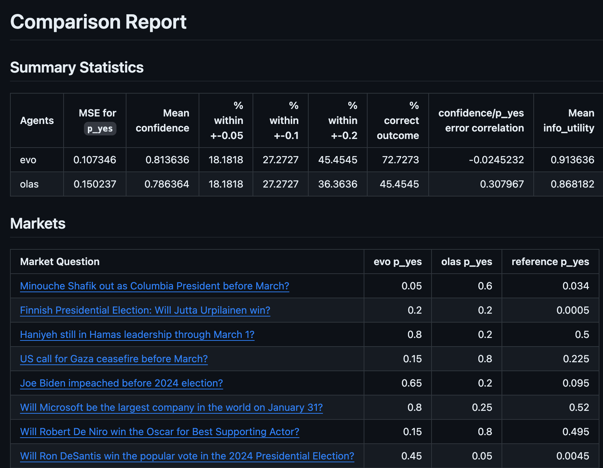
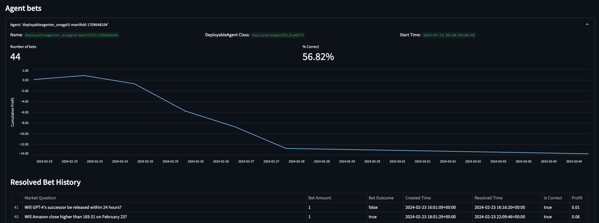

# Prediction Market Agent Tooling

Tooling for benchmarking, deploying and monitoring agents for prediction market applications.

## Setup

Install the project dependencies with `poetry`, using Python >=3.10:

```bash
python3.10 -m pip install poetry
python3.10 -m poetry install
python3.10 -m poetry shell
```

Create a `.env` file in the root of the repo with the following variables:

```bash
MANIFOLD_API_KEY=...
BET_FROM_ADDRESS=...
BET_FROM_PRIVATE_KEY=...
OPENAI_API_KEY=...
```

## Benchmarking

Create a benchmarkable agent by subclassing the `AbstractBenchmarkedAgent` base class, and plug in your agent's research and prediction functions into the `predict` method.

Use the `Benchmarker` class to compare your agent's predictions vs. the 'wisdom of the crowd' on a set of markets from your chosen prediction market platform.

For example:

```python
import prediction_market_agent_tooling.benchmark.benchmark as bm
from prediction_market_agent_tooling.benchmark.utils import get_manifold_markets

benchmarker = bm.Benchmarker(
    markets=get_manifold_markets(number=10),
    agents=[...],
)
benchmarker.run_agents()
md = benchmarker.generate_markdown_report()
```

This produces a markdown report comparing agents:



## Deploying

Create a deployable agent by subclassing the `DeployableAgent` base class, and implementing the 

For example, deploy an agent that randomly picks an outcome:

```python
import random
from prediction_market_agent_tooling.deploy.agent import DeployableAgent
from prediction_market_agent_tooling.markets.agent_market import AgentMarket

class DeployableCoinFlipAgent(DeployableAgent):
    def answer_binary_market(self, market: AgentMarket) -> bool:
        return random.choice([True, False])

DeployableCoinFlipAgent().deploy_gcp(...)
```

## Monitoring

Monitor the performance of the agents deployed to GCP, as well as meta-metrics of the prediction market platforms they are deployed to.

This runs as a streamlit app on a localhost server, executed with:

```bash
streamlit run examples/monitor/monitor.py
```

Which launches in the browser:



## The Market Platforms

The following markets platforms are supported:

- [Manifold](https://manifold.markets/)
- [AIOmen](https://aiomen.eth.limo/)
- [Polymarket](https://polymarket.com/) - Benchmarking only. Deploy and monitor TODO

## Contributing

See the [Issues](https://github.com/gnosis/prediction-market-agent-tooling/issues) for ideas of things that need fixing or implementing. Or come up with your own :D.

We use `mypy` for static type checking, and `isort`, `black` and `autoflake` for linting. These all run as steps in CI.
